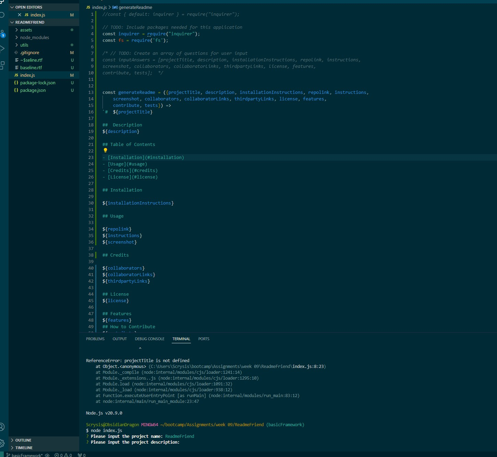

#  ReadmeFriend

##  Description
A backend application designed to make creating Readme files for projects easy and simple!

## Table of Contents 

- [Installation](#installation)
- [Usage](#usage)
- [Credits](#credits)
- [License](#license)

## Installation

1) Install node version 8.2.4, 2) run "npm install" while the terminal is opened to the project directory.

## Usage

Repository Link:
https://github.com/Scrysis/ReadmeFriend

Usage Instructions:
Open up this project folder in your terminal.  Then type "node index.js" into the terminal, and hit enter.  Then answer the following questions.

Media:

## Credits

Collaborators:
Partial discussion with Jessica Clark about options.
Collaborator Links:
https://github.com/jessclark1234 
Third Party Links:
None.

## License

User License:
GNU License

## Features

Type in information, get a nice readme file when done.

## How to Contribute

How you can contribute:
Comment on bugs or features you would like to see as a user!

## Tests
Testing protocol of the application:
Manual testing.
